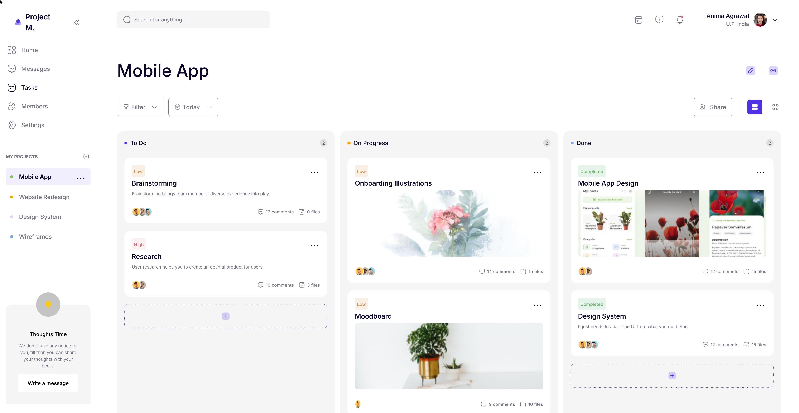

# Carthagine Showcase

#### **[carthagine.ai](https://carthagine.ai)**

---

This is a repository containing the source code generated by Carthagine c1, a
frontend coding agent, from a Figma design in the [Carthagine c1 showcase
video](https://www.youtube.com/watch?v=oXL7GosuRms&utm_source=github).

Carthagine c1 is an AI-powered system that generates a production-ready,
pixel-perfect React component hierarchy from an arbitrary Figma design. It is
[currently in closed beta](https://carthagine.ai?utm_source=gh).

Credits for the [original Figma
design](https://www.figma.com/community/file/1073116958099793906) go to
[Nickelfox Design](https://www.nickelfox.com).

## Running locally

Run `npm install`, followed by `npm run dev`, then navigate to
`http://localhost:3000`.

## About the generation

c1 is invoked by putting a special `<Carthagine />` component into the source
code as a placeholder for the converted design. Upon picking a Figma file, the
agent starts work on converting it into React code, and will eventually add files
for all components and replace the `<Carthagine />` invocation with the root.

c1 can output code in a variety of coding standards, dictated by a manual
per-codebase setup. In this case, the project uses Next.js + TypeScript + SVGR,
and the workspace was configured to put all assets into `public/`, all components
directly into `src/components/`, and to use CSS modules, merging related
functionality into multiple CSS modules. (The alignment and robustness of this
codebase integration generally degrades with added complexity and
unconventionality of the standards.)

By convention, c1 generates all components as controlled except the top-level
one, where it implements placeholder logic for the UI. This facilitates easy
connection to existing state management solutions, backend APIs, etc.

## Inspecting state

The page will open with a minimized state inspector for the root component. Click
on the minus button to open it, after which you can observe the state as it
changes in response to your actions.

Additionally, the components might emit special logs which will show up as toasts
at the bottom of the screen.

(There is no magic in either of these---c1 generates `carthagineInspect` and
`carthagineLog` statements to make the "hand-off" smoother. They are expected to
be removed once real functionality is added.)

## Accuracy

The Carthagine engine is under active development. Small omissions and mistakes
during generation are to be expected at this stage, especially for large designs
such as the one used in this showcase. Some degree of error is inherent in
today's frontier language models.

We are also currently developing c2, an improved, steerable version of c1 based
on the same engine, which allows observing intermediate states and close
collaboration during a conversion task.

This code has had a `<button>` invocation in `TaskCard.tsx` replaced with
`
`, as the previous code didn't work with Next.js server-side rendering. (No
other change has been made compared to the code generated in the video.)

Also, see [the comparison with an o1 zero-shot
approach](o1-comparison/README.md).

## How to use the AI?

Please apply to join the closed beta at https://carthagine.ai. Our capacity is
limited at the moment, so we provide access on a best-effort basis.
