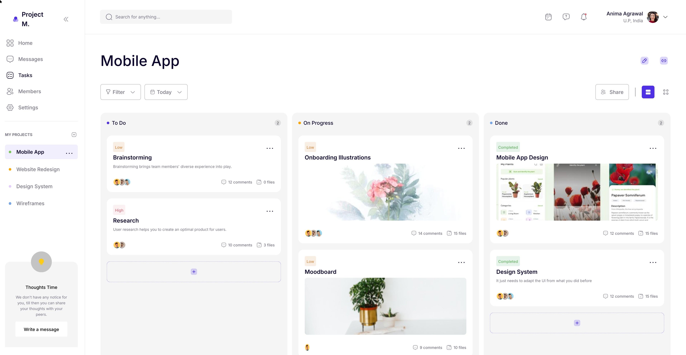

# Carthagine vs Prompting OpenAI o1 Directly

This directory contains the output of OpenAI o1 given an image of the same Figma
design used for the [Carthagine c1 showcase](../README.md), and a prompt asking
it to create a production-ready, fully-featured and pixel perfect React code,
including a full component hierarchy.

This type of approach forms the basis of a large number of Figma -> React tools
on the market.

To view the UI in action, run `npm install`, then `npm run dev`.

Here's a visual comparison side-by-side to compare:

## Reference design (Figma)

## Output of prompting o1 directly

## Output of Carthagine c1

## Discussion

While the zero-shot understanding of UIs from images continues to amaze us in
frontier models (and is indeed the foundation on which Carthagine was built on
in the first place), their precision leaves a lot to be desired:

❌ o1 uses very approximate colors, spacings, and fonts;

❌ Various UI elements from the original design were reordered and/or left out,
   or have missing icons.

❌ The approach is conservative no matter how hard to prompt it to do otherwise:
   a lot of events and handlers are missing, and functionality is not
   implemented.

❌ The high-level understanding is lacking which can be seen in the data model;
   for example, the Project -> Task one-to-many relation is not encoded anywhere

The resulting code provides a good starting point, but a frontend engineer using
the Figma as a reference would still need to adjust many styles, add many event
handlers, and make a lot of changes in order to reach parity with the design.

Honestly, by that point, it's easier to just do it from scratch.

In contrast, Carthagine:

✅ Matches exact colors, paddings, and even exports actual vector icons from
  Figma

✅ Creates a 1-to-1 translation in terms of including all components, buttons,
  and features (e.g. task image attachments)

✅ Connects every button and input in the UI to a dummy event handler,
  ready for customization

✅ Creates a contextually-aware data model and an architecture that follows it

